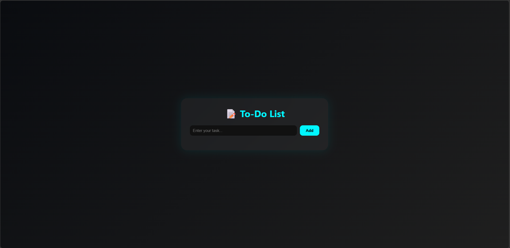
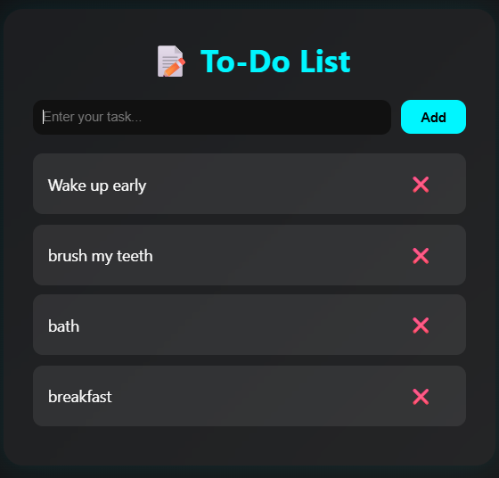

# 📝 To-Do List


A simple, lightweight, and responsive **To-Do List web application** built using **HTML, CSS, and vanilla JavaScript**.

The application allows users to create tasks, remove tasks, and keep their task list saved locally in the browser using the **Web Storage API**.

No backend, database, framework, or installation is required.

---

# 📑 Table of Contents

- Features
- Screenshots
- Live Demo
- Technologies
- Project Structure
- How It Works
- Data Persistence
- Installation
- Future Improvements
- Contributing
- License
- Author

---

# ✨ Features

✅ Add New Tasks

✅ Delete Tasks

✅ Persistent Task Storage

✅ Browser LocalStorage Support

✅ Automatic Task Restoration

✅ Clean Glassmorphism Interface

✅ Responsive Layout

✅ Dark UI Theme

✅ Smooth Task Animations

✅ Lightweight and Fast

✅ No Backend Required

---

# 📸 Screenshots

## 🏠 To-Do List

<p align="center">

</p>

---

## 📝 Task Management

<p align="center">

</p>

---

# 🚀 Live Demo

https://dhruvpandit46.github.io/To-Do-List/

---

# ⚙ Technologies Used

- HTML5
- CSS3
- JavaScript (ES6)
- DOM Manipulation
- Web Storage API
- LocalStorage

---

# 📂 Project Structure

```text
To-Do-List/
│
├── index.html
├── style.css
├── script.js
├── images/
└── README.md
```

---

# ⚡ How It Works

### 1. Add a Task

Enter a task into the input field and click **Add**.

JavaScript creates a new task element and stores the task in LocalStorage.

### 2. Display Tasks

When the application loads, previously saved tasks are retrieved from LocalStorage and displayed automatically.

### 3. Delete a Task

Click the ❌ button next to a task to remove it from the interface and LocalStorage.

---

# 💾 Data Persistence

The application uses the browser's **LocalStorage** to save tasks.

Tasks are stored under:

```javascript
localStorage.getItem("tasks")
```

When a new task is created:

```javascript
localStorage.setItem("tasks", JSON.stringify(tasks))
```

When the application starts, the saved tasks are loaded automatically.

This means tasks remain available even after:

- Refreshing the page
- Closing the browser
- Reopening the application

The data is stored locally on the user's device.

---

# 🧠 Application Logic

The application is built around a small set of JavaScript functions:

```text
addTask()
    │
    ├── Create task element
    │
    └── Save task to LocalStorage
          │
          ▼
      LocalStorage
```

For loading saved tasks:

```text
Page Load
    │
    ▼
loadTasks()
    │
    ▼
LocalStorage
    │
    ▼
Create Task Elements
```

For deleting tasks:

```text
Delete Button
    │
    ▼
Remove UI Element
    │
    ▼
Remove Task From LocalStorage
```

---

# 🎨 UI Highlights

- Dark gradient background
- Glassmorphism container
- Cyan accent color
- Rounded task cards
- Responsive layout
- Smooth fade-in animation
- Minimal and distraction-free interface

---

# 📦 Installation

Clone the repository:

```bash
git clone https://github.com/dhruvpandit46/To-Do-List.git
```

Go inside the project:

```bash
cd To-Do-List
```

Open:

```text
index.html
```

in your browser.

No dependencies or package installation are required.

---

# 🎯 Future Improvements

- Mark tasks as completed
- Edit existing tasks
- Task priorities
- Due dates
- Categories and tags
- Search and filtering
- Drag-and-drop task ordering
- Task counters
- Dark/Light theme switch
- Export and import tasks
- Cloud synchronization
- Firebase integration
- PWA support
- Offline support

---

# 🤝 Contributing

Contributions are welcome.

1. Fork the repository

2. Create your feature branch

```bash
git checkout -b feature/new-feature
```

3. Commit your changes

```bash
git commit -m "Add new feature"
```

4. Push your branch

```bash
git push origin feature/new-feature
```

5. Open a Pull Request

---

# 📜 License

Licensed under the **MIT License**.

MIT © 2026 Dhruv Pandit.

See the [LICENSE](LICENSE) file for full license details.

---

# 👨‍💻 Author

**Dhruv Pandit**

GitHub

https://github.com/dhruvpandit46

LinkedIn

https://linkedin.com/in/dhruv-pandit-755786326

Instagram

https://instagram.com/dhruv_pandit2007

---

# ⭐ Support

If you found this project useful,

please consider giving it a ⭐ on GitHub.

It helps support future development.
